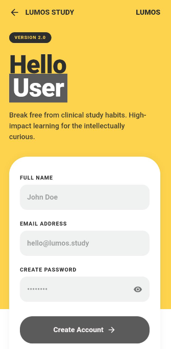
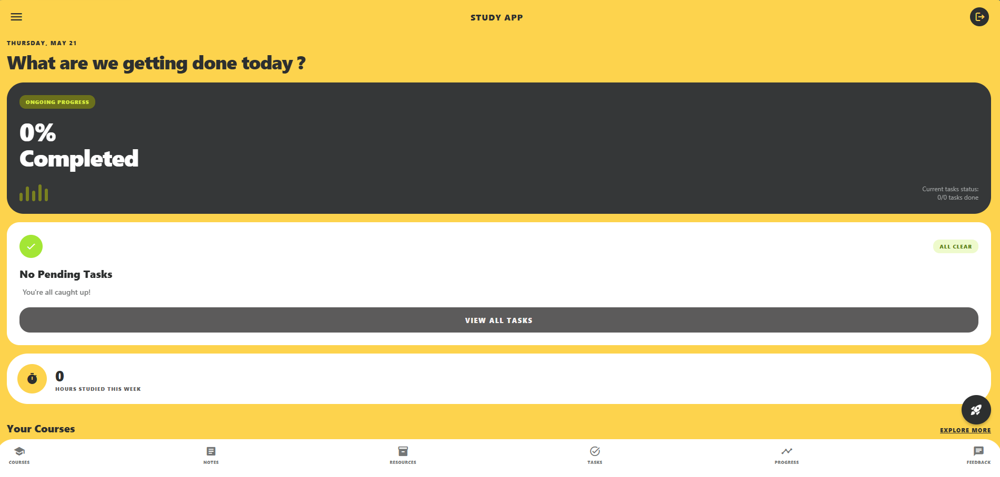

# Student Educational App

A full-stack student educational application developed using Expo/React Native with features for course management, notes management, study resources, task tracking, study progress tracking, and feedback management.

## 🚀 Live Demo

- Frontend (Netlify): [Frontend Live Site](https://app.netlify.com/projects/student-edu-app/configuration/deploys)
- Backend (Railway): [Backend API](https://railway.com/project/3ce6d41a-2bf2-40e0-a114-27617d2b090f?environmentId=7446d09d-1218-482a-ab83-207331fe7ead)

## ✨ Features

- 📚 Course Management
- 📝 Notes Management
- 📂 Study Resource Management
- ✅ Study Task Tracking
- 📈 Study Progress Tracking
- ⭐ Feedback and Rating Management

## 🛠️ Technologies Used

### Frontend

- Expo
- React Native
- JavaScript

### Backend

- Node.js
- Express.js
- MongoDB

### UI





### Deployment

- Frontend deployed on [Netlify](https://www.netlify.com/)
- Backend deployed on [Railway](https://railway.com/)
- Database hosted on [MongoDB Atlas](https://www.mongodb.com/cloud/atlas/register)

## ⚙️ Installation

### Clone the repository

```bash
git clone https://github.com/kasuni-17/Student-Educational-App.git
cd App
```

### Install frontend dependencies

```bash
npm install
```

### Install backend dependencies

```bash
cd Backend
npm install
```

## ▶️ Run the Application

### Frontend

```bash
cd frontend
npm start
```

### Backend

```bash
cd Backend
node server.js
```

## 🔑 Environment Variables

Create a `.env` file inside the Backend folder and add:

```env
MONGO_URI=your_mongodb_connection
PORT=5000
JWT_SECRET=your_secret_key
```

## 👩‍💻 Author

Developed by Kasuni Lakshika.
```
